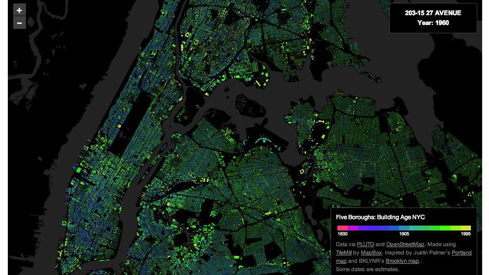
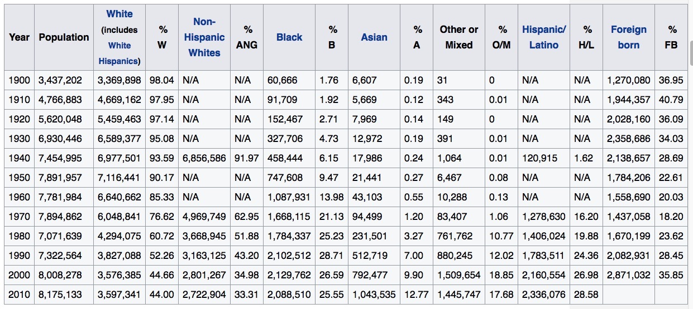

## Module 2: NYC Buildings Data Analysis

```{r warning=FALSE, message=FALSE, echo=FALSE}
library(knitr)
library(sqldf)
library(ggplot2)
library(bigvis)

WRITE_DATA <- FALSE

if(WRITE_DATA){
  data_MN <- read.csv("data/MN.csv", header = TRUE)
  data_BK <- read.csv("data/BK.csv", header = TRUE)
  data_BX <- read.csv("data/BX.csv", header = TRUE)
  data_QN <- read.csv("data/QN.csv", header = TRUE)
  data_SI <- read.csv("data/SI.csv", header = TRUE)
  
  data <- do.call("rbind", list(data_BK, data_BX, data_MN, data_QN, data_SI))
  saveRDS(data, file="all_PLUTO_data.R")
}

data <- readRDS("all_PLUTO_data.R")
# filter for relevant fields:

data <- data[,c("Borough","LotArea","BldgArea", "NumBldgs", "NumFloors", "YearBuilt", "YearAlter1", "YearAlter2", "AssessTot")]

kable(head(data), caption = "A Look at the NYC Buildings Data")

###########################################################################################
# use bigvis to bin, condense, smooth and present data

```

# Q1: Accuracy of the Building History Data

*Build a graph to help the city determine when most buildings were constructed. Is there anything in the results that causes you to question the accuracy of the data? ? (note: only look at buildings built since 1850)*

```{r warning=FALSE, message=FALSE, echo=FALSE}
par(mfrow=c(1,2))
hist(data$YearBuilt, main="All Buildings Built", xlab="Year", ylab="Num Buildings Built")
hist(subset(data, YearBuilt > 1850)$YearBuilt, main="Buildings Built after 1850", xlab="Year", ylab="Num Buildings Built")

# So we're doing 1850 forwards...
data <- subset(data, YearBuilt > 1850)
# and if there's any left with no floors, get rid of them too...
data <- subset(data, NumFloors > 0)
```

Seeing such a concentration of buildings built around 1940 at first seems a bit drastic.  The image below, taken from [here](http://gizmodo.com/the-exact-age-of-almost-every-building-in-nyc-in-one-m-1348558392) seems to agree with this though, with the majority of NYC having a blue/dark green tone, confirming that the majority of today's buildings were built in that time period.  It also makes you see that there is also a field called "Year Altered", so perhaps the storyline is that the NYC building acreage was all claimed around the 1940s, but then was rebuilt vertically to keep up with demand.  

\includegraphics{nyc_buildings_created_heatmap.jpg}


The NYC population by year would probably correlate to the total number of floors by year, and wikipedia's [Demographic history of New York City](https://en.wikipedia.org/wiki/Demographic_history_of_New_York_City) tells us that the NYC population growth did in fact level off around mid-century. (See image below)

\includegraphics{NYC_Population_History_Wikipedia.jpg}


Therefore, aside from data such as NumFloors being zero, it seems that this data is realistic.

## Q2: Number of Floors by Year

*The city is particularly worried about buildings that were unusually tall when they were built, since best-practices for safety hadn’t yet been determined. Create a graph that shows how many buildings of a certain number of floors were built in each year (note: you may want to use a log scale for the number of buildings). It should be clear when 20-story
buildings, 30-story buildings, and 40-story buildings were first built in large numbers.*

```{r warning=FALSE, message=FALSE, echo=FALSE}
library(plyr)
require(gridExtra)

data$floors_tens <- round_any(data$NumFloors, 10, f = floor)
#tail(data$floors_tens)

data$years_tens <- round_any(data$YearBuilt, 10, f = floor)
#tail(data$floors_tens)

floors_decades_summary <- sqldf("select years_tens, floors_tens, count(*) as the_count from data group by years_tens, floors_tens order by years_tens, floors_tens")

#floors_decades_summary$the_count <- condense(bin(floors_decades_summary$the_count, 10))
floors_decades_summary$log_count <- log10(floors_decades_summary$the_count)

kable(tail(floors_decades_summary), caption = "Floors by Decade with Log10")

plot1 <- ggplot(floors_decades_summary, aes(x = years_tens, y = log_count, colour=factor(floors_tens))) + geom_line() + xlab("Decade") + ylab("Log(Number of Buildings Built)") + ggtitle("Number of Buildings by Decade and Number of Floors") + scale_colour_discrete(name = "Number of Floors")

plot2 <- ggplot(floors_decades_summary, aes(x = years_tens, y = log_count, fill=factor(floors_tens))) + geom_bar(stat='identity') + xlab("Decade") + ylab("Log(Number of Buildings Built)") + ggtitle("Number of Buildings by Decade and Number of Floors") + scale_fill_discrete(name="Number of Floors")

plot1

plot2

```

Bear in mind that we have removed the zero floor rows initially from the data, so these zero floors really are showing us buildings with floors 1-9, and the floor() function translated these to zero, ie less than 10.

## Q3: Value per floor per year

*Your boss suspects that buildings constructed during the US’s involvement in World War II (1941-1945) are more poorly constructed than those before and after the war due to the high cost of materials during those years. She thinks that, if you calculate assessed value per floor, you will see lower values for buildings at that time vs before or after. Construct a chart/graph to see if she’s right.*

```{r warning=FALSE, message=FALSE, echo=FALSE}
data_with_floors <- subset(data, NumFloors > 0);
data_with_floors$val_per_floor <-  data_with_floors$AssessTot / data_with_floors$NumFloors
#head(data_with_floors$val_per_floor)

val_per_floor_per_year <- sqldf("select YearBuilt, avg(val_per_floor) as mean_val_per_floor from data_with_floors group by YearBuilt order by YearBuilt")

val_per_floor_per_year$years_in_question <- FALSE
for(yr in c(1941,1942,1943,1944,1945)){
  val_per_floor_per_year[val_per_floor_per_year$YearBuilt == yr,]$years_in_question <- TRUE
}

ggplot(val_per_floor_per_year, aes(YearBuilt, mean_val_per_floor, colour = years_in_question)) + geom_point() + ggtitle("Value per Floor per Year") + guides(colour=FALSE) + xlab("Year") + ylab("Mean Value per Floor")

```

In this case, I would tell my boss that her conclusion is not validated by this data.
